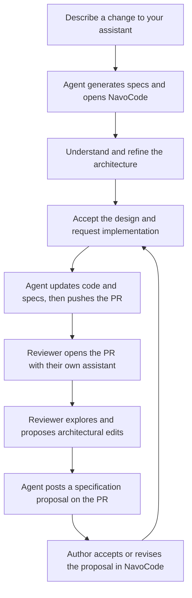

# NavoCode

**The human interface to an AI-maintained codebase.**

NavoCode lets humans design, understand, change, and review software through an interactive architectural representation. Your coding agent reads and edits the code underneath. Your normal workflow stays in NavoCode—from the first idea through PR review and acceptance.

**Status:** This repository currently documents the product design. The UI, integrations, installer, and commands described here are planned and are not available to run yet.

## Intent

The core idea is that humans interact with this layer instead of code.

You work with responsibilities, boundaries, contracts, data ownership, behaviors, and tradeoffs. The agent handles implementation details, tests, and Git operations. NavoCode connects human intent to the implementation through structured specifications.

This requires more than diagrams. The interface must explain the complete change, let you explore alternatives, capture your decisions, and show whether the agent's implementation matches the accepted design. Authors and reviewers get the same interactive experience.

Source references remain available for audit and exceptional investigation. Reading code or raw diffs must not be a required step in the normal human workflow.

## What the workspace shows

A PR opens as an architectural change map, grouped by purpose rather than by file or function. A large PR might include “change account ownership,” “move billing responsibility,” and “introduce an external integration.” Each group can be expanded without turning the overview into a giant graph.

The workspace combines:

- Before-and-after diagrams of responsibilities and interactions.
- Intended behavior, reasons for changes, and effects on other groups.
- Decisions, alternatives, tradeoffs, contracts, and migration choices.
- Evidence of implementation and testing, with uncertainty shown clearly.
- Interactive controls to ask questions, propose alternatives, and accept a design.

Every changed file must be accounted for underneath this representation. Supporting changes are summarized; unexplained changes appear as gaps. Humans see complete coverage without navigating file-by-file.

Select a responsibility and say:

> Keep billing policy in the billing service. Account management should expose ownership information and delegate billing decisions. Show the consequences before implementing.

Your agent revises the design in the same workspace. You explore the result, refine it, and request implementation when satisfied.

## The complete workflow

NavoCode makes no LLM calls. Your existing assistant reasons, implements, and tests. NavoCode supplies the specification format, interactive workspace, validation, and feedback transport.

## Installation

Once implemented, the intended setup is to ask your assistant:

> Install NavoCode from https://github.com/120devin/NavoCode for this project. Configure it for manual invocation.

For every PR:

> Install NavoCode for this project and use it whenever you prepare or update a PR.

The planned installer adds a skill or plugin, preserves existing configuration, and checks whether the assistant can receive UI feedback. Project-scoped installation lets the team use the same workflow.

| Assistant | Planned integration | Invocation |
| --- | --- | --- |
| Claude Code | Plugin with author/review skills and a feedback adapter | `/navocode:author`, `/navocode:review`, or a natural-language request |
| Codex | Project skill in `.agents/skills/navocode/`; optional plugin packaging | Select the NavoCode skill or ask Codex to use it |
| Cursor | Project skill in `.cursor/skills/navocode/`; optional plugin packaging | `/navocode` or a natural-language request |
| GitHub Copilot CLI | Project skill in `.github/skills/navocode/` and a feedback adapter | Ask Copilot to author or review using NavoCode |
| GitHub Copilot on GitHub | Repository instructions and specs consumed by an enabled cloud agent | Mention `@copilot` with the requested task |
| Other assistants | Portable skill, CLI, and compatible feedback adapter | Ask the assistant to run the workflow |

Each integration must demonstrate a working UI → agent → updated UI loop. Skill discovery alone is insufficient. Released documentation will identify complete interactive integrations and limited artifact-only integrations.

GitHub's cloud-agent route depends on its eligibility, repository settings, and permissions. It does not automatically provide NavoCode's interactive panel inside GitHub. See the official [Claude plugin](https://code.claude.com/docs/en/plugins), [Codex skill](https://learn.chatgpt.com/docs/build-skills), [Cursor skill](https://cursor.com/docs/skills), and [Copilot cloud-agent](https://docs.github.com/en/copilot/how-tos/use-copilot-agents/cloud-agent/use-cloud-agent-on-github) documentation.

## Author a change

Tell your assistant:

> Use NavoCode to design delegated billing ownership for enterprise accounts. Show the responsibilities, contracts, and migration choices before implementing.

The agent inspects the codebase and opens a draft architecture in NavoCode. You explore the design and adjust it through diagrams, decision controls, and conversation. The workspace distinguishes proposed behavior from behavior already implemented.

When ready:

> Implement this accepted design, verify it, and prepare the PR with its NavoCode specs.

The agent changes code, runs relevant checks, and reconciles the implementation with the design. NavoCode shows the resulting architectural change and evidence. The agent pushes code and specs together when authorized through your existing assistant workflow.

### Make it part of every PR

Project configuration guides supported assistants to enter NavoCode when preparing or updating a PR. Native hooks can automate entry where supported. An optional deterministic CI check can require current, valid specs.

CI does not invoke a model or generate architectural understanding. Automatic invocation must be tested for each assistant; a configuration file alone cannot guarantee it.

## Review a PR

In your own assistant:

> Use NavoCode to review https://github.com/OWNER/REPO/pull/123. Open the full architectural change and explain the decisions.

The agent fetches the PR and specs, checks their revision, and opens the same workspace used by the author. You do not manually pull the branch or read its raw diff. The agent fetches source or prepares a temporary checkout as needed underneath the experience.

Suggest a change:

> Move permission decisions into the authorization boundary. Compare that alternative with the current proposal, including migration and client compatibility.

Explore and refine the result, then say:

> Post this as a NavoCode proposal on the PR.

Your agent publishes a readable proposal with structured specification edits. Publication does not change the original PR's implementation.

## What the team sees on GitHub

The PR contains an architectural summary, supported diagram previews, spec references, and instructions for opening the interactive workspace through an assistant. GitHub comments carry proposal discussion; the assistant-connected workspace supplies the full interaction.

A proposal comment includes:

> **NavoCode proposal: centralize permission decisions**
>
> **Based on:** PR #123, head `abc123…`, specification revision `…`
>
> **Change:** Move permission decisions from account management into authorization.
>
> **Reason:** Keep policy ownership consistent across entry points.
>
> **Consequences:** A new contract dependency; migration must preserve client behavior.
>
> **Status:** Proposed; implementation has not changed.
>
> **Structured edits:** Included in a collapsible machine-readable section.

The author or an authorized maintainer asks their assistant:

> Open the proposal at COMMENT_URL in NavoCode. Show its effect on the current PR and implement the changes I accept.

The agent checks whether the proposal still applies, presents conflicting or changed assumptions, and updates code and specs after adoption. A result comment links the resulting revision.

Large proposals can reference specification-only artifacts or branches. Private content stays in appropriately private artifacts. A generated HTML snapshot is a browsing fallback, not a live agent session.

An enabled GitHub cloud agent can also receive requests from write-authorized contributors through `@copilot`. Its capabilities are documented separately; the full interactive reviewer experience requires a compatible assistant integration.

## What lives where

This repository will contain the shared schema, deterministic core, UI, CLI, skills, host adapters, and optional GitHub validation workflow.

Consuming projects keep accepted specs under `.navocode/`. Code and specs travel together in Git. Review proposals and discussion live in GitHub comments or linked artifacts.

There is no NavoCode account, hosted database, model key, or inference backend. A local UI process can hold temporary session data. Durable collaboration records live in Git and GitHub.

MCP is optional. The baseline uses skills, CLI tools, and a supported feedback bridge. A host-specific MCP adapter can be added where useful.

The representation must expose uncertainty and missing evidence rather than hide them. Specs do not prove arbitrary implementation correctness; the agent must support claims with relevant checks and show unresolved gaps in human-readable terms.

## License

[Apache License 2.0](LICENSE).
